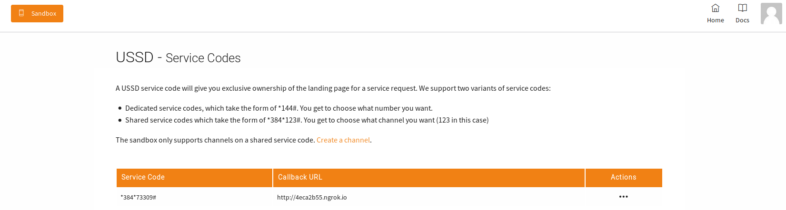

# Africa's Talking USSD

This document explains how to setup Africa's Taking USSD with the Ushahidi Platform USSD Service.

* [Create an Account with Africa Talking](www.africastalking.com)
* [Create a USSD Service Code in the Sandbox ](https://account.africastalking.com/apps/sandbox/ussd/codes)

Africa's Talking allows you add a Callback URL for each USSD Service Code.  
This basically is the URL of the USSD Service you have deployed or running locally \(while using Ngrok to expose your localhost\).

